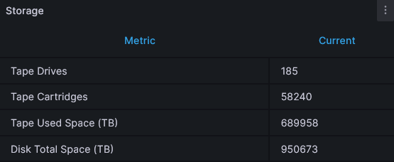

# What is Big Data?

## Data evolution

1 ZB  
1,000,000 PB  
1,000,000,000,000 GB  
1,000,000,000,000,000,000,000 B  

## Some figures

{width="50%"}

## Some figures in sciences

:::::::::::::: {.columns}
::: {.column width="50%"}

### Earth Observation Data

:::
::: {.column width="50%"}

### CERN

- The LHC experiments produce about 90 petabytes of data per year
- an additional 25 petabytes of data are produced per year for data from other (non-LHC) experiments at CERN

[Yo can have a look](https://monit-grafana-open.cern.ch/d/000000884/it-overview?orgId=16)

:::
::::::::::::::

## 3V, 4V, 5V{background-image="https://www.lebigdata.fr/wp-content/uploads/2016/05/les-4-V-du-big-data-ibm.jpg"}

## What is Behind Big Data

HTML?

<table width="30%">
    <tr><td>1 </td><td>	B</td><td> 	byte</td></tr>
    <tr><td>1000 </td><td>	kB</td><td> 	kilobyte</td></tr>
    <tr><td>1000^2 </td><td>	MB</td><td> 	megabyte</td></tr>
    <tr><td>1000^3 </td><td>	GB</td><td> 	gigabyte</td></tr>
    <tr><td>1000^4 </td><td>	TB</td><td> 	terabyte</td></tr>
    <tr><td>1000^5 </td><td>	PB</td><td> 	petabyte</td></tr>
    <tr><td>1000^6 </td><td>	EB</td><td> 	exabyte</td></tr>
    <tr><td>1000^7 </td><td>	ZB</td><td> 	zettabyte</td></tr>
</table>

## Big Data definition

# Legacy “Big Data” ecosystem

## Blowing ecosystem

## Hadoop & Map Reduce

## NoSQL

## Logs, ETL, Time series

## Dataviz

## Data Science and Machine Learning

# Big Data use cases

## Cost effective storage and processing

## Data mining, data value, data cross processing

## Scientific data processing

## Digital twins, Predictive maintenance, Intelligent City, real time processing

# Big Data to Machine Learning

## Big Data allows machine learning to be effective

## Distribute datasets and algorithms

## Pre processing before machine learning
