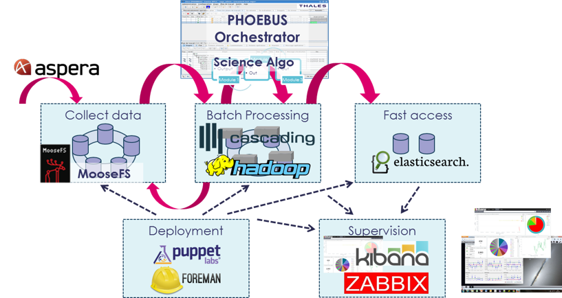
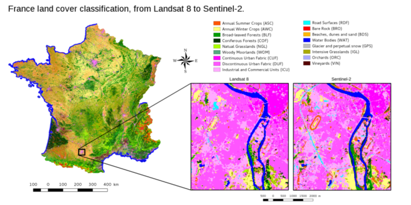

# What is Big Data?

## Data evolution

1 ZB  
1,000,000 PB  
1,000,000,000,000 GB  
1,000,000,000,000,000,000,000 B  

## Some figures

{width="50%"}

## Some figures in sciences

:::::::::::::: {.columns}
::: {.column width="50%"}

### Earth Observation Data

{width="60%"}

:::
::: {.column width="50%"}

### CERN

- The LHC experiments produce about 90 petabytes of data per year
- an additional 25 petabytes of data are produced per year for data from other (non-LHC) experiments at CERN

[You can have a look](https://monit-grafana-open.cern.ch/d/000000884/it-overview?orgId=16)

:::
::::::::::::::

## 3V, 4V, 5V{background-image="https://www.lebigdata.fr/wp-content/uploads/2016/05/les-4-V-du-big-data-ibm.jpg"}

## What is Behind Big Data

:::::::::::::: {.columns}
::: {.column width="50%"}

### Data

Volume, variety, multiple sources, internal, external...

### Tools and technology

Store, Compute, Analyse: Calculators, Cloud, Hadoop, Spark, Dask

Visualize, Use: Applications, Web interfaces

:::
::: {.column width="50%"}

### Definition (Wikipedia)

> Big data is a field that treats ways to analyze, systematically extract information from, or otherwise deal with data sets that are too large or complex to be dealt with by traditional data-processing application software.

> Big data is where parallel computing tools are needed to handle data.

Not a technology.

:::
::::::::::::::

# Legacy “Big Data” ecosystem

## Blowing ecosystem{background-image=https://external-preview.redd.it/P6JcS17ECpmFF2si8KVnuoKpiabc5-pWTmgRt_YxTx4.png?auto=webp&s=3cbdbbe95112b6d6f5fb0bb59f6421b8e8be999e}

## Hadoop & Map Reduce

## NoSQL (Not only SQL)

:::::::::::::: {.columns}
::: {.column width="50%"}

{width=50%}

:::
::: {.column width="50%"}

:::
::::::::::::::

## Logs, ETL, Time series

:::::::::::::: {.columns}
::: {.column width="50%"}

{width=60%}

:::
::: {.column width="50%"}

{width=60%}

:::
::::::::::::::

## Dataviz

:::::::::::::: {.columns}
::: {.column width="50%"}

### BI (softwares)

{width=50%}

:::
::: {.column width="50%"}

### Python (libraries)

{width=60%}

:::
::::::::::::::

## Data Science and Machine Learning

# Big Data use cases

## Cost effective storage and processing

- Commodity hardware (standard servers, disks and network)
- Horizontal scalability
- Proximity of Storage and Compute
- Secure storage (redundancy or Erasure Coding)

Use cases:

- Archiving
- Massive volume handling
- ETL (Extract Transform Load)

## Data mining, data value, data cross processing

Extract new knowledge and value from the data:

- Statistics,
- Find new Key Performance Indicators,
- Explain your data with no prior knowledge (Data Mining)

Cross analyse internal and external data, correlation:

- Trends with news or social network and correlation to sales
- Near real time updates with Stream processing

## Scientific data processing

Data production or scientific exploration:

- Stream processing, or near real time processing from sensor data
- Distributed processing of massive volume of incomming data on computing farm
- Data exploration and analysis
- Data Science

{width=40%}

## Other main use cases

:::::::::::::: {.columns}
:::

- Digital twins
- Predictive maintenance
- Smart City
- Real time processing

:::
:::

:::
::::::::::::::

# Big Data to Machine Learning

## Big Data ecosystm allows (part of) machine learning to be effective

- More data = more precise models
- Deep Learning difficult without large (optionnaly generated) input datasets
- Tools to collect, store, filter, index, structure data
- Tools to analyse and visualize data
- Real time model learning

https://blog.dataiku.com/when-and-when-not-to-use-deep-learning

## Pre processing before machine learning

- Data wrangling and exploration
- Feature engineering: unstructured data to input features
- Cross mutliple data sources
- Get insights on the data before processing it (statistics, vizualisation)

## Distribute datasets and algorithms

- For preprocessing as seen above
- Means to load and learn on large volumes by distributing storage
- Distributed learning with data locality on big datasets
- Distributed hyper parameter search

{width=60%}

