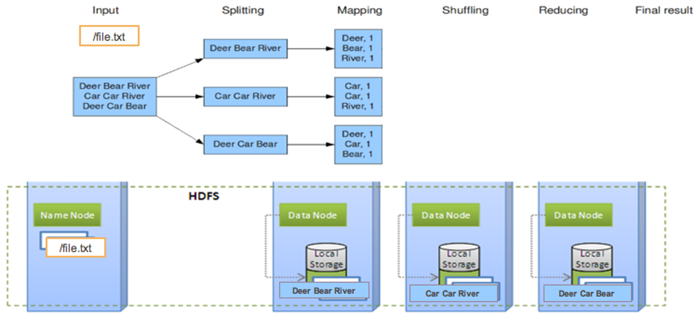
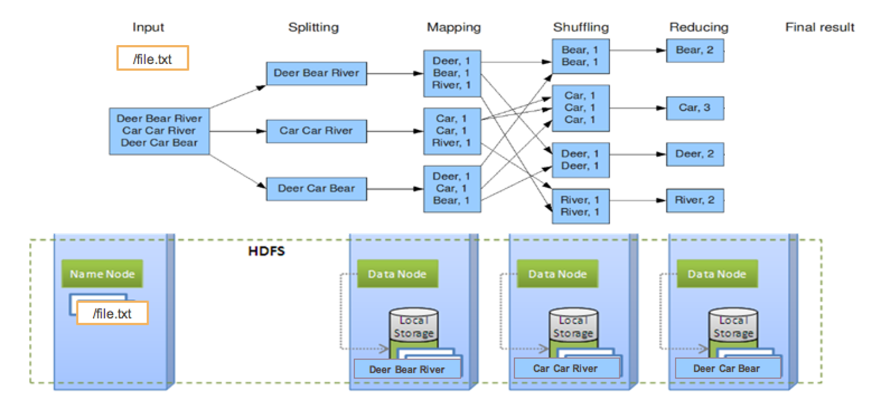
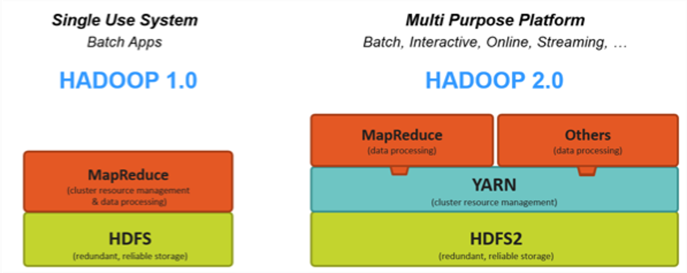
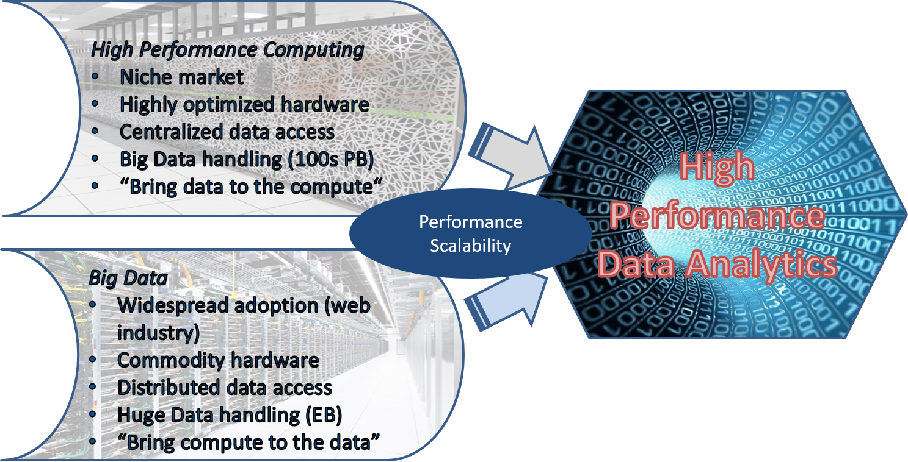
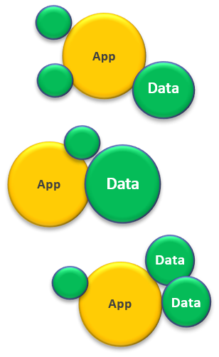
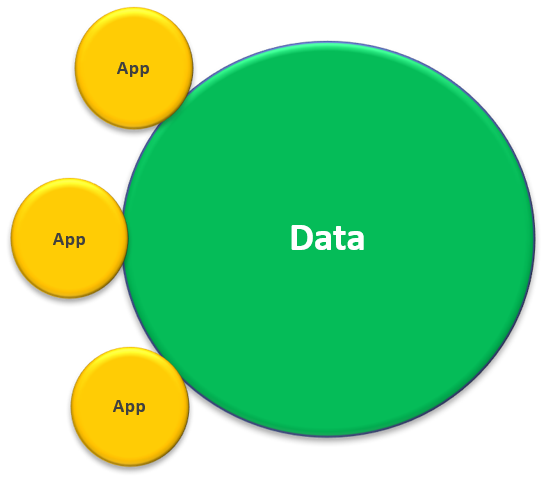
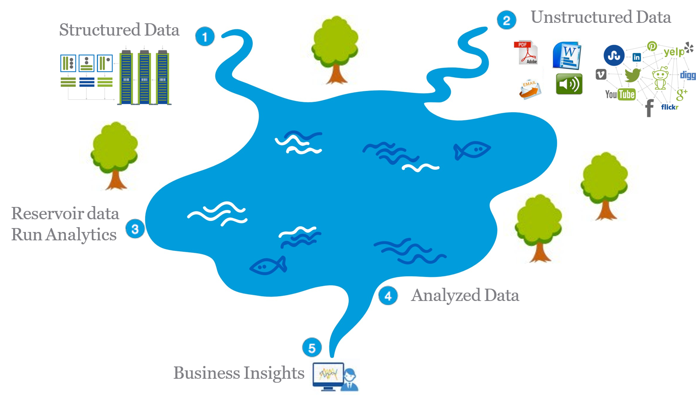
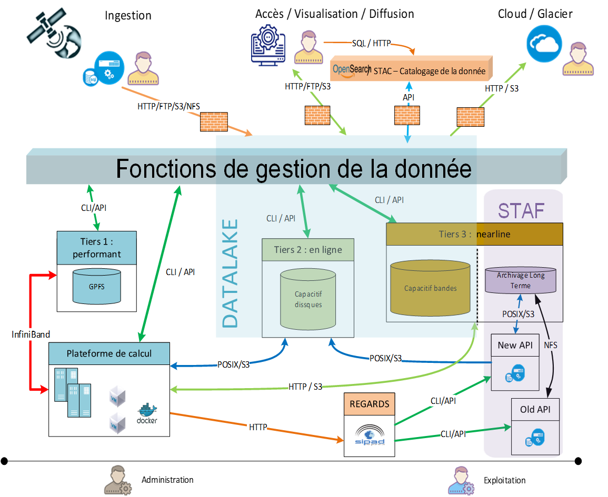

# Hadoop

## Introduction

What is Hadoop?

Open source framework supported by Apache foundation:

- Store and process massive amount of data
- In a distributed way
- On "commodity" hardware (i.e. not expensive)

## A complex ecosystem

:::::::::::::: {.columns}
::: {.column width="50%"}

{width=80%}

:::
::: {.column width="50%"}

Numerous Apache Software Foundation projects:

- Each covering a specific functionnality
- With their own developer community
- And their own development cycle

:::
::::::::::::::

## Hadoop distributions

TODO

## HDFS and MapReduce principles

### Two main components of Hadoop

- Distributed Software Defined Storage: HDFS (Hadoop Distributed File System)
{height=50px}
- Distributed Data Processing: MapReduce
{height=50px}

### Principles

- Split and store data on a cluster of servers (with local storage)
- Process data localy (on the server which owns it)
- Horizontal scalability: add or remove machines, on the fly, for compute or storage

## Hadoop cluster components{background-image=https://pbs.twimg.com/media/EKzU0wMWsAAkKLc.jpg data-background-opacity=0.4}

- CLuster of "commodity" servers
- **Shared Nothing** architecture: only shared component is _standard_ network
- Each machine is a node which own both storage and compute

Each cluster is composed of:

- Master nodes: handle metadata and knowledge of the whole infrastructure
- Worker nodes: 
  - Host distributed pieces of data
  - Execute data processing algorithm parts

## Hadoop story, from google to Spark

{height=40%}

# HDFS 

## HDFS Basics

:::::::::::::: {.columns}
::: {.column width="50%"}

### Distributed File System

- Written in **Java**
- Allowing to **store** massive amounts of data, 
  - structured or not, 
  - on a machines cluster
- Extensible and portable
- One of the first **Software Defined Storage** 
  - (OK, Google was here first)

:::
::: {.column width="50%"}

### Data blocks

- Data is **splitted** and **distributed**
  -  among the Hadoop cluster
- Splitted into 128MB (default) **blocks**
- With a **replication** factor for preventing data loss 
  - (3 replicas default)
- Hadoop 3: **Erasure coding**
  - similar durability as replication 3, 
  - but **only 50%** volume increase
  - instead of 200%

In HDFS, data are of **writen-once** type (no inline modifications)

:::
::::::::::::::

## HDFS blocks repartition

## HDFS Daemons

:::::::::::::: {.columns}
::: {.column width="60%"}

### Namenode

- Accountable for data locality and file system global namespace
- Daemon on a dedicated server
- Hosts metadata, create, remove, move files and folders
- Knows nodes wich own the parts of a file
- Needs to be replicated and secured (loss of metadata = loss of all data)

:::
::: {.column width="40%"}

### Datanode

- Stores and loads data blocks
- Daemon on every worker nodes
- Reading and writing of data
- Creation and Deletion of blocks

:::
::::::::::::::

## HDFS Architecture

# Map Reduce

## Map Reduce Basics

- **Functional** language concept
- Heavily used by Google for **WWW indexing**
- **Colocate** data and processing (with Hadoop and others)
- Automatic process **ditribution** on pieces of data (eager distribution)
- Optimized for fast processing of **huge datasets**
- **Fault tolerant**: 
  - Data is replicated, 
  - Individual task can be restarted anywhere

## Wordcount (1. storage)

{style="background:white"}

## Wordcount (2. split)

{style="background:white"}

## Wordcount (3. map)

{style="background:white"}

## Wordcount (4. shuffle)

{style="background:white"}

## Wordcount (5. reduce)

{style="background:white"}

## Wordcount (6. result)

{style="background:white"}

## YaRN

- Yet Another Resource Negociator...
- Introduced in Hadoop v2
- Separation between
  - Resources scheduling and cluster state
  - Job execution and distribution

{width=40%}
{width=40%}

# From HPC to Big Data to Cloud and High Performance Data Analytics

## HPC platform, story and use case

:::::::::::::: {.columns}
::: {.column width="50%"}

> HPC = High Performance Computing

- Firsts HPC platforms built in the 1960s
- Mainly compute bounds algorithms
- At first for Weather forcasting and Aerodynamic research
- Structure modeling and fluid mecanics by discretization
- Needs (needed?) high performance hardware (network, CPUs, storage)
- Compute and storage are separated
- Uses a resource scheduler

:::
::: {.column width="50%"}

:::
::::::::::::::

## TOP500

| Rank | System | Cores | Rmax (TFlop/s) | Rpeak (TFlop/s) | Power (kW) |
|------| -------|-------|----------------|-----------------|------------|
| 1 | Supercomputer Fugaku - Japan  | 7,630,848 | 442,010.0 | 537,212.0 | 29,899 |
| 2 | Summit - United States | 2,414,592 | 148,600.0 | 200,794.9 | 10,096 |
| 3 | Sierra - United States | 1,572,480 | 94,640.0 | 125,712.0 | 7,438 |
| 8 | JUWELS Booster Module - Germany | 449,280 | 44,120.0 | 70,980.0 | 1,764 |
| 21 | PANGEA III - France | 291,024 | 17,860.0 | 25,025.8 | 1,367 |
| 92 | Jean Zay - France | 93,960 | 4,478.0 | 7,345.6 |

[Top 500 (june 2021)](https://top500.org/lists/top500/list/2021/06/)

## Big Data and Hadoop

- First platforms in the 2000's
- Mainly data bound algorithms
- Limitation in standard ethernet network performances = data locality
- At first for web indexing, or large amount of textual or tabular data analysis
- Web giant problem, then banking or IT stuf
- Use commodity hardware
- Compute and storage colocated

## HPDA convergence

{width=50%}

- Hadoop world step to HPC: YaRN, equivalent to HPC resources scheduler
- HPC step to Big Data: hardware not so specialized
- Hadoop big limitation: non standard File System and compute and storage colocation
- HPC big limitation: storage can be difficult to scale

## Cloud computing basics

Hence the cloud computing model...

- Compute resources separated from storage (but proximity is key)
- Can host anything, at first not compute oriented
- Object store model: Software Defined Storage as HDFS, specific interface (S3)
- Horizontal scalability of compute AND storage
- Resources on demand, mutualized between millions of users
- Infinite resources like for user

## Distributed programming: Hadoop vs HPC vs Cloud

:::::::::::::: {.columns}
::: {.column width="33%"}

### Hadoop

- Data bound algorithms
- Statistics
- Big volumes in input
- Often small outputs
- Can be used for computing problems, but not physical simulation

:::
::: {.column width="33%"}

### HPC (MPI)

- Compute bound algorithms
- Small or medium amount of inputs, 
- Medium or big outputs (big simulations)
- Can be used for data processing too (Dask)

:::
::: {.column width="33%"}

### Cloud

- Anything: services, storage bound, compute bound
- Object store limitations for some HPC workflow
- Or not anymore: HPC as a Service
- Big Data as a Service too...

:::
::::::::::::::

## Machine Learning Computations

### Machine learning

- Either lots of data in inputs
- Or lots of models to train (hyperparameter search)
- And of course data preprocessing
- Big Data or HPC or Cloud

### GPGPU

- Specific hardware (expensive)
- Really efficient for Deep Learning algorithms
- Image processing, Language processing

# BI vs Big Data

## Business Intelligence

> Business intelligence (BI) comprises the strategies and technologies used by enterprises for the data analysis of business information.
>
> BI technologies provide historical, current, and predictive views of business operations. 

_Wikipedia_

Business Intelligence _can_ use Big Data ecosystems, but is more commonly considered something different.

https://medium.com/doctolib/data-engineers-are-no-longer-data-folks-d10d44712580
https://alphalyr.fr/blog/difference-bi-business-intelligence-big-data/

## Classical BI key points

- Build data systems from Business questions
- KPI and business decisions oriented
- Data warehouse, mainframe = Big server with closed technology
- Use structured data, like SQL databases, 
- Oriented towards Data Value

## Big Data key points

- Find insights from the data systems, 
- KPI and business of course, but many more use cases
- Distributed architecture, lot of Open Source
- Different toolset (Hadoop, Python), 
- Every data flavor, keep anything!
- Data Volume, Variety, Velocity

# Hadoop and Big Data legacy

## Is Hadoop dead?

Not quite yet. Still used in many places.

. . .

But clearly the two main components (HDFS and MapReduce) are now deprecated.

. . .

And have led the path to better alternatives.

## Future of Big Data

Infrastructure: Private or public cloud, and HPC(DA) in some cases.

. . .

HDFS? Object Storage!

. . .

MapReduce? Spark, Dask.

. . .

Chunked file format (SequenceFile)? Parquet, Zarr, Cloud optimized Geotiff.

. . .

YaRN? HPC job scheduler, or Kubernetes

# Datalakes

## Toward a new data management model

:::::::::::::: {.columns}
::: {.column width="50%"}

### Process centric

- Structured Data
- Internal sources
- Important data only
- Multiple copies

{height=40%}

:::
::: {.column width="50%"}

### Data centric

- Multiple types (structured, semi-structured, unstructured)
- Multiple sources (internal, external)
- Everything
- One copy

{height=40%}

:::
::::::::::::::

## Host and process different kind of data

{width=60%}

## Typical Architecture

{width=80%}

## CNES Datalake infrastructure example

{width=70%}
