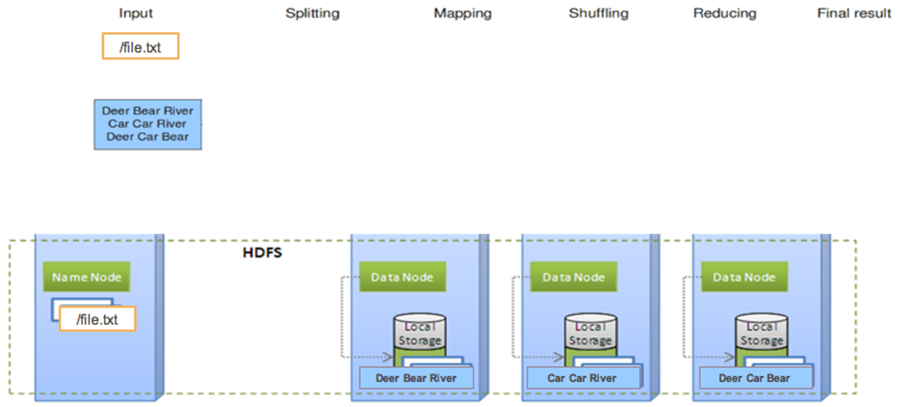
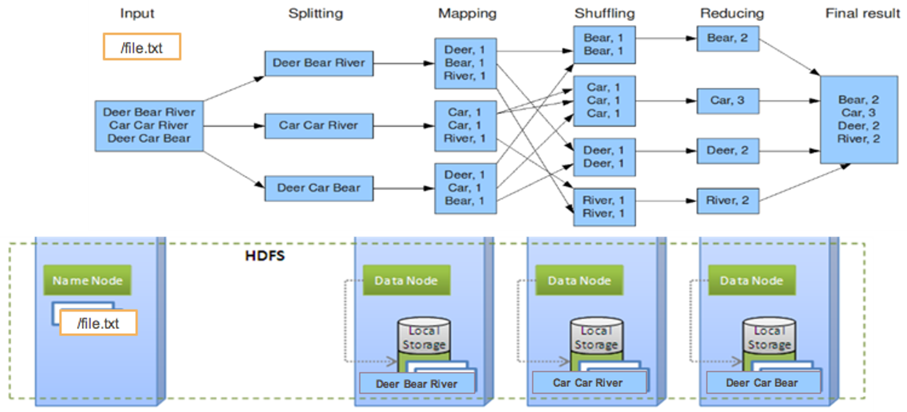

# Hadoop

## Introduction

### What is Hadoop?

Open source framework supported by Apache foundation:

- Store and process massive amount of data
- In a distributed way
- On "commodity" hardware (i.e. not expensive)

### A complex ecosystem

:::::::::::::: {.columns}
:::

{width=60%}

:::
:::

Numerous Apache Software Foundation projects:

- Each covering a specific functionnality
- With their own developer community
- And their own development cycle

:::
::::::::::::::

## HDFS and MapReduce principles

### Two main components of Hadoop

- Distributed Software Defined Storage: HDFS (Hadoop Distributed File System)

- Distributed Data Processing: MapReduce

### Principles

- Split and store data on a cluster of servers (with local storage)
- Process data localy (on the server which owns it)
- Horizontal scalability: add or remove machines, on the fly, for compute or storage

## Hadoop cluster components{background-image=https://pbs.twimg.com/media/EKzU0wMWsAAkKLc.jpg data-background-opacity=0.4}

- CLuster of "commodity" servers
- **Shared Nothing** architecture: only shared component is _standard_ network
- Each machine is a node which own both storage and compute

Each cluster is composed of:

- Master nodes: handle metadata and knowledge of the whole infrastructure
- Worker nodes: 
  - Host distributed pieces of data
  - Execute data processing algorithm parts

## Hadoop story, from google to Spark

# HDFS 

## HDFS Basics

Distributed File System:

- Written in **Java**
- Allowing to **store** massive amounts of data, structured or not, on a machines cluster
- Extensible and portable
- One of the first **Software Defined Storage** (OK, Google was here first)

Data is splitted and distributed among the Hadoop cluster:

- Splitted into 128MB (default) **blocks**
- With a **replication** factor for preventing data loss (3 replicas default)
- Hadoop 3: **Erasure coding** = similar durability as replication 3, but only 50% volume increase

In HDFS, data are of **writen-once** type (no inline modifications)

## HDFS blocks repartition

## HDFS Daemons

:::::::::::::: {.columns}
:::

### Namenode

- Accountable for data locality and file system global namespace
- Daemon on a dedicated server
- Hosts metadata, create, remove, move files and folders
- Knows nodes wich own the parts of a file
- Needs to be replicated and secured (loss of metadata = loss of all data)

:::
:::

### Datanode

- Stores and loads data blocks
- Daemon on every worker nodes
- Reading and writing of data
- Creation and Deletion of blocks

:::
::::::::::::::

## HDFS Architecture

# Map Reduce

## Map Reduce Basics

- **Functional** language concept
- Heavily used by Google for **WWW indexing**
- **Colocate** data and processing (with Hadoop and others)
- Automatic process **ditribution** on pieces of data (eager distribution)
- Optimized for fast processing of **huge datasets**
- **Fault tolerant**: 
  - Data is replicated, 
  - Individual task can be restarted anywhere

## Wordcount (1. storage)

## Wordcount (2. split)

## Wordcount (3. map)

## Wordcount (4. shuffle)

## Wordcount (5. reduce)

## Wordcount (6. result)

## YaRN

- Yet Another Resource Negociator...
- Introduced in Hadoop v2
- Separation between
  - Resources scheduling and cluster state
  - Job execution and distribution

# From HPC to Big Data to Cloud and High Performance Data Analytics

## HPC platform, story and use case

## Big Data and Hadoop

## HPDA convergence

## Cloud computing basics, object store and compute on demand

### Infinite resources

## Distributed programming: Hadoop vs HPC vs Cloud

### Hadoop: data bound algorithms: statistics, often big volume in inputs, small outputs

### HPC (MPI): compute bound algorithm, small or medium amount of inputs, medium or big outputs (big simulations)

### Cloud: anything, but object store limitations for some HPC workflow (or not anymore?)

## Distributed Machine Learning, GPGPU computing

### ML: Either lots of data in inputs, or lots of models to train (hyperparameter search).

### GPGPU: really efficient for DL algorithm (image processing, Language processing)

# BI vs Big Data

## 

https://medium.com/doctolib/data-engineers-are-no-longer-data-folks-d10d44712580
https://alphalyr.fr/blog/difference-bi-business-intelligence-big-data/

## BI : KPI, Data warehouse, mainframe, structuring data, SQL, Data Value

## Big Data: find insights from the data, distributed architecture, different tooling (Python …), Data Volume, Variety

# Hadoop legacy: Spark, Dask, Object Storage, File format, Datalakes

## HPDFS

Object Store same ideas.

## MapReduce

Spark, Dask

## Sequence File, chunked File

Parquet, Zarr, CoG

## Datalakes

from process centric to data centric, different kind of data, architecture and example
