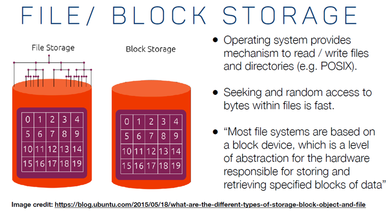
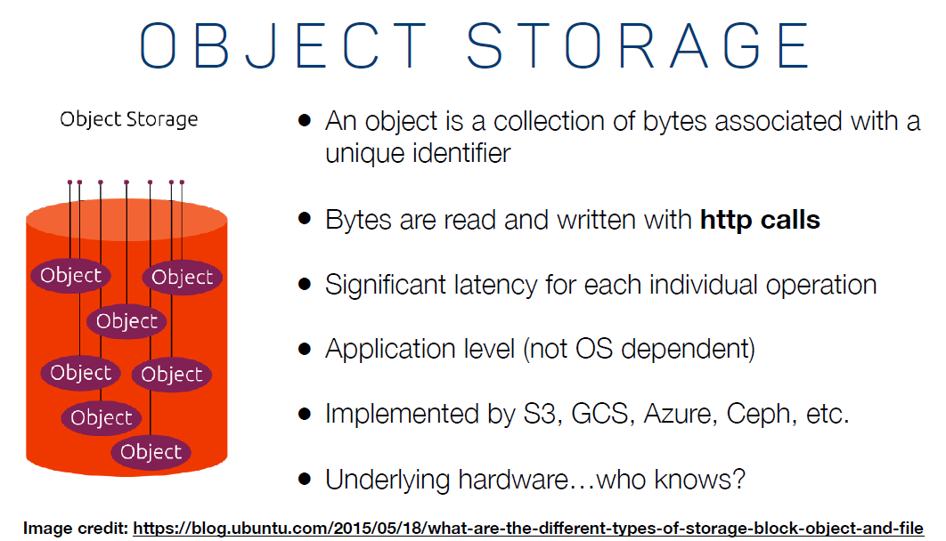

# Credits and thanks

## Didn't do this

Thanks to [Florient Chouteau](florient.f.chouteau@airbus.com>) and Dennis Wilson 

for their work on this subject.

I took most of the content [from theirs](https://supaerodatascience.github.io/OBD/1_1_overview.html).

# What is the Cloud?

## {background-image=https://nerds.net/wp-content/uploads/2018/02/cloud-computer-reality-750x646.jpg}

## But it's a bit bigger...


(Facebook's data center & server racks)

## Google Cloud Data Center locations


## Cloud Definition

> The cloud is a real physical place - accessed over the internet - where a service is performed for you or where your stuff is stored. Your stuff is stoed in the cloud, not on your device because the cloud is not on any device; the cloud lives in datacenters. A program running on your device accesses the cloud over the internet. The cloud is infinite, accessible from anywhere, at any time

Todd Hoff in "Explain the Cloud like I'm 10"

## Cloud Computing

Using cloud resources for any purpose, web server, storage, computations.

- The cloud is a set of **cloud providers**
- Renting cloud **services**
- Increasingly **abstracted** from the physical hardware

. . .

Examples:

- "Renting a server" ... (this is pure "cloud computing")
- "Replicated & Secure storage space"
- "Autoscaling deployment of a microservice"

## A portion of AWS services

{width=70%}

## How?

# Virtualization

## Definition

> In computing, virtualization refers to the act of creating a virtual (rather than actual) version of something, including virtual computer hardware platforms, storage devices, and computer network resources.

Wikipedia

> Basically we are running software on "abstract hardware" which is a "portion" of a real computer ("bare metal")

## Desktop virtualization

{width=75%}

## Server virtualization


## Virtualization evolution


## Definitions

- Hypervisor (VMWare, Virtualbox, KVM): A hypervisor is a program for creating and running virtual machines
- Virtual Machine: A virtual machine is the emulated equivalent of a computer system that runs on top of another system
- Containers: Isolated environments that share the same underlying OS (more this afternoon) & resources

## Opens up new possibilities

:::::::::::::: {.columns}
::: {.column width="50%"}

### Hardware abstraction

- Hardware Abstraction ("download more RAM")
- Fine-grained resource allocation / sharing
- Decouple maintenance of hardware from maintenance of software

:::
::: {.column width="50%"}

### Reliability, security...


:::
::::::::::::::

# Cloud history

## AWS

Once upon a time...

Amazon (the e-commerce store) has "scaling" issues


## Idea

2002-2003; The idea

> Building an infrastructure that is completely standardized, completely automated, and relied extensively on web services for things like storage 

http://blog.b3k.us/2009/01/25/ec2-origins.html

## So ...

So basically Amazon became very good at *running* scalable infrastructure as *services*

- For themselves...
- ... but also for other partners (target)

And that infrastructure is often there to answer peak load...

## Let's sell it !


# The many layers of Cloud Computing

## Public, hybrid, private

{width=50%}

## Different layers of abstractions


## Abstraction examples

- Using data storage service like google cloud storage without managing the infrastructure
- Using google drive
- Renting a server with hard drive and storing data

. . . 

- Using data storage service like google cloud storage without managing the infrastructure **PaaS**
- Using google drive **SaaS**
- Renting a server with hard drive and storing data **IaaS**

# Cloud Engines

## Public


## Public (European)


Academic, public founded:


## Private/on premise


## Leaders


## In France


# Cloud computing: usage revolution

## A technical evolution

- More Virtualization
- More API
- More Managed Services

## Access and operating computing power

- Outsourcing infra, maintenance, security, development of new services
  - Less (?) operation cost (or at least burden)
- Pay-per-use, pay as you go, change of economical model
- "Infinitely scalable" for common folks
- "No need to plan out" infrastructure
  - Enabling innovation
  - Power in the hands of developpers/builders

## Technical benefis

- Infrastructure as Code
- Continuous Deployment
- Infinite resources
- On demand scalability and resources

## Changing the way we interact with hardware

We interact with cloud providers using APIs...

```bash
gcloud compute --project=deeplearningsps instances create ${INSTANCE_NAME} \
    --zone=${ZONE} \
    --machine-type=n1-standard-8 \
    --scopes=default,storage-rw,compute-rw \
    --maintenance-policy=TERMINATE \
    --image-family=ubuntu-1804-lts \
    --image-project=ubuntu-os-cloud \
    --boot-disk-size=200GB \
    --boot-disk-type=pd-standard \
    --accelerator=type=nvidia-tesla-p100,count=1 \
    --metadata-from-file startup-script=startup_script.sh
```

## Infrastructure as Code

- Infrastructure is now managed via text files
- Data is securely stored on storage
- So we store code + urls on git... and everything is reproducible ! (not _that_ simple)
- We use automated deployment tools (terraform, gcp deployment manager...)

## Pet vs Cattle


# New Data Processing standard

## Object store

High througput storage system with horizontal scalability




## Compute as a service

- Start and stop compute resources when needed
  - IaC tools like Terraform, Ansible
  - Mesos/Nomad nd Other tools.
- Kubernetes as a Service
  - With autoscaling features: add Vms if Needed
  - Dask, Spark and other processing tools plugged in
- Function as a Service
  - Just put a bit of code, everything else is handled.
- HPC as a Service
  - With POSIX filesystem (sometimes over Object store)
  - And high performance network.

# Discussions and Troll

## Is using cloud computing less expensive?

- 👍 Depend on your {normal / peak} utilization
- 👍 Access to latest hardware without investment
- 👎 Fully utilized hardware is more expensive on the cloud
- 👎 CLOUD HYGIENE !
  - Watch for unused services / storage
  - Shutdown machines when not used
  - Services stack up...

## Is using cloud computing more secure / safer.

- 👍 The best engineers in the world working on it
- 👍 Secure regions / private cloud...
- 👎 Your data somewhere in some datacenter...
- 👎 "Dependency" towards your cloud provider...
- 👎 Still need to handle security inside you resources

# First interaction with Google Cloud

## TP Google Cloud

Everyone has its credits?

how to get a server? 

TP through Google console, account, princing, ressources… VMs and Kubernetes
