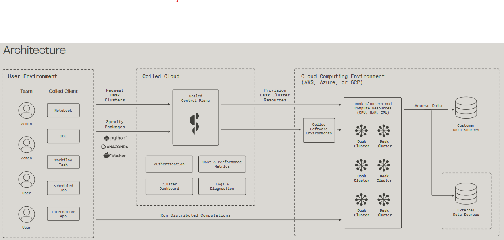

# Credits and thanks

## Didn't do this

Thanks to [Florient Chouteau](florient.f.chouteau@airbus.com>) and Dennis Wilson 

for their work on this subject.

I took most of the content from theirs:
- https://supaerodatascience.github.io/OBD/slides/1_4_containers.html
- https://supaerodatascience.github.io/OBD/slides/1_5_orchestration.html
- https://supaerodatascience.github.io/OBD/slides/2_3_kubernetes.html#/

# Containers

## Why containers?

- How to get software to run reliably when moved from one computing environment to another
  - from a developer's laptop to a test environment
  - from staging to prod
- Packaging application + runtime as a syngle package
- Abstract differences in OS and underlying hardware
- Build once, run anywhere
- Pet vs Cattle, at another level

## Container vs VM


## Container vs VM: similarities and drawbacks

:::::::::::::: {.columns}
::: {.column width="30%"}

### Similarities

* Isolated environments for applications
* Movable between hosts

:::
::: {.column width="40%"}

## VM Drawbacks

* VM Contains full OS at each install => Install + Resource overhead
* VM needs pre-allocation of resource for each VM (=> Waste if not used)
* Communication between VM <=> Communication between computers

:::
::: {.column width="30%"}

## Continers Drawbacks

* Containers are Linux based (but still works on Windows)
* Isolation is not perfect since containers share underlying kernels 
  * (security and stability)

:::
::::::::::::::

## Applications concept


## Containers for Data science

:::::::::::::: {.columns}
::: {.column width="50%"}

Data Science is about **reproducibility**

* Experimental science
* Communicating results
* Hands-out to other teams
* Deployment and versioning of models

:::
::: {.column width="50%"}

So... containers ?

* ... for deployment
* ... for standardized development environments
* ... dependency management
* ... for complex / large scale workflows

:::
::::::::::::::

# Docker

## Docker

Docker is **a** solution that **standardizes** packaging and execution of software in isolated
 environments
 (**containers**) that share resources and can communicate between themselves

> Build, Share, and Run Any App, Anywhere


## History

[Docker](https://www.docker.com/)

* Created in 2013
* Open Source (some parts)
* Not a new idea but set a new standard
* Docker is a company built around its main product (Docker Engine)
* In charge of dev of everything docker + additional paid services (Docker hub...)

## Under the hood

Docker is some fancy tech over linux kernel capabilities (containers)


[more info](https://medium.com/@goyalsaurabh66/docker-basics-cb006b9be243)

## Using Docker in practice


## Vocabulary of Docker

* **Layer**: Set of read-only files to provision the system
* **Image**: Read-Only layer "snapshot" (or blueprint) of an environment. Can inherit from another **Image**. Image have a *name* and a *tag*
* **Container**: Read-Write instance of an **Image**
* **DockerFile**: Description of the process used to build an Image
* **Container Registry**: Repository of Docker Images
* **Dockerhub**: The main container registry of docker.com

## Workflow


## Layers, Container, Image


## Layer / Image Analogy

Docker:
```Dockerfile
FROM python:3.6
RUN pip install torch
CMD ipython
```

```bash
docker build -f Dockerfile -t my-image:1.0 .
docker run my-image
```

Python:
```python
class BaseImage:
    def __init__(self, a):
       self.a = a

class NewImage(BaseImage):
    def __init__(self, a, b):
       super(NewImage, self).__init__(a=a)
       self.b = b

container = NewImage(a=0,b=1)
```

## Dockerfile

* Used to build Images

```Dockerfile
FROM python:3.7
ENV MYVAR="HELLO"
RUN pip install torch
COPY my-conf.txt /app/my-conf.txt
ADD my-file.txt /app/my-file.txt
EXPOSE 9000
WORKDIR "/WORKDIR"
USER MYUSER
ENTRYPOINT ["/BIN/BASH"]
CMD ["ECHO” , "${MYVAR}"]
```

```bash
docker build -f Dockerfile -t my-image:1.0 .
docker run my-image
```

* Reproducible (if you include static data)
* Can be put under version control (simple text file)

## Architecture


## Registry

* Local registry: All images/containers in your machine
* https://hub.docker.com/
* GCP Container Registry
* Social Dimension (share docker images to speed up development/deployment)

## Alternatives: Singularity


"Docker for HPC"

- No root daemon process
- Better (?) security
  - Rootless build and run
- Better isolation between users, "just" a process
- Bridge between Dockerimage and Singularity images
- OCI compliant

## Alternatives: Podman


"Rootless Docker for Redhat"

- Not root daemon
- Not need to be root
- Fully compliant with Docker images (and OCI)
- Better security and isolation

# Hands on Docker

## Play with Docker

* You need to have a docker hub account : https://hub.docker.com/
* https://labs.play-with-docker.com/
* Free, interactive, cluster of vms to experiment docker with
* https://training.play-with-docker.com/ lots of resoures !

# Kubernetes

## Why orchestration?

Suppose I have a large pool of machines available

* How do I **deploy my container**?
* How do I **put the right containers at the right spot**?
* How do I **scale (up and down) to demand**?
* How do I **expose the http endpoints**?
* How do I **manage failure of containers**?
* How do I **update my model without downtime**?

## Tools example

Examples...

- Docker Swarm
- CoreOS Fleet
- [Apache Mesos](https://mesos.apache.org/) / [Marathon](https://github.com/mesosphere/marathon)

... and so many more !


## Short Kubernetes history

Kubernetes (or k8s) comes from Google's internal systems [Borg](https://github.com/SupaeroDataScience/OBD/blob/master/readings/borg.pdf)

It is open source now <https://github.com/kubernetes> and used... everywhere ?

## Thanks to Dennis for the next part

[Slides](https://supaerodatascience.github.io/OBD/lectures/2_3_kubernetes.html)


# Processing platform on Kubernetes

## Kubeflow

https://www.kubeflow.org/

{width=55%}

## Jupyterhub/Binder

{width=70%}

## Databricks: Spark as a Service

{width=50%}

## Coiled: Dask as a Service



# Kubernetes tutorial

## Try some

https://training.play-with-kubernetes.com/kubernetes-workshop/ 

https://www.katacoda.com/courses/kubernetes

https://labs.play-with-k8s.com/

https://github.com/yogeek/kubernetes-local-development


